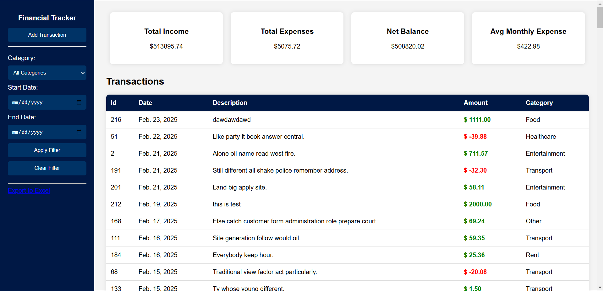

# Financial Transaction Tracker

A Django-based web application for managing personal finances. Track income and expenses, view financial summaries, and export data to Excel.

## Features
- Add, view, and delete transactions.
- Filter transactions by category and date range.
- View financial summaries (total income, total expenses, net balance, average monthly expense).
- Export transactions to Excel.
- Visualize data using Chart.js (line chart and bar chart).
- Monthly budget alerts.

---

## Setup Instructions

### Prerequisites
- Python 3.8 or higher
- Django 4.0 or higher
- `openpyxl` (for Excel export)
- `python-dateutil` (for date calculations)

### Installation
1. Clone the repository:
   ```bash
   git clone https://github.com/yourusername/financial-tracker.git
   cd financial-tracker
      
2. Install dependencies:
   ```bash
   pip install -r requirements.txt

3. Run migrations:
   ```bash
   python manage.py migrate
   
4. Seed the database with mock data:
   ```bash
   python manage.py seed_transactions
   
5. Start the development server:
   ```bash
   python manage.py runserver

## AI Usage Report
The following frontend components were built with AI assistance:

## CSS Structure 
CSS styles for the transaction table, summary cards,  were generated with AI.

## Export to Excel Button
The button and logic for exporting transactions to Excel were implemented with AI assistance.

## Backend Logic
The backend logic (models, views, and calculations) was primarily written manually to ensure data integrity and accuracy.

AI was used for discussing and refining the logic but not for writing the final code.

AI provided the backend view logic for generating the Excel file.

## Screenshots




